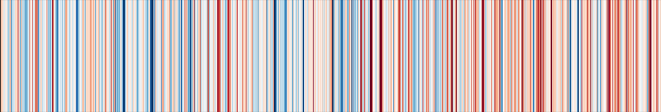

### Hi there 👋

I am a Senior Research Engineer at [Simula Research Laboratory](https://www.simula.no) and a Qualified 3PFF [GO FAIR Foundation](https://www.gofair.foundation) facilitator and a [GO FAIR Foundation Fellow](https://www.gofair.foundation/fellow).

As an advocate for Open Science, FAIR Software, and Data, I am dedicated to fostering innovation through enhanced data management and collaboration. With extensive experience in the implementation of FAIR principles, I focus on leveraging these methodologies to drive scientific and technological advancements.

My professional journey includes roles in academia, international organizations, and small enterprises across Norway, the United Kingdom, and France. I hold a Master’s degree in Computer Science and a Ph.D. in Remote Sensing and Cloud Modelling from the University of Clermont-Ferrand, France.

**Key Skills**:

- Open Science and FAIR principles
- Data management and software development
- Cross-disciplinary collaboration and project management
- Innovation enablement through FAIR methodologies

**Professional Experience**:

- Leading initiatives in data and software standardization
- Enhancing collaboration and data sharing in scientific communities
- Driving innovation by implementing FAIR data principles

**Career Highlights**:

- Successfully contributed to the development of the European Open Science Cloud (EOSC)
- Played a key role in promoting FAIR for machine learning initiatives
- Actively involved in projects that enable innovation through better data management

**Career Goals**:
I am eager to apply my expertise in Open Science and FAIR principles to new challenges in the tech or research sectors. I am particularly interested in roles that allow me to drive innovation, enhance data interoperability, and facilitate impactful collaborations.

**Ask me about**:
- European Open Science Cloud (EOSC) in practice
- FAIR data and software
- [FAIR Digital Objects](https://fairdo.org)
- FAIR for machine learning
- Enabling innovation through FAIR principles
- Galaxy Climate Science Workbench

**Current Projects**
- 🔭 I’m currently working on:
  - [GO FAIR Foundation Fellows Programme](https://www.gofair.foundation/fellow): I am working with the larger GO FAIR community to learn more about FAIR implementation approaches and help others to implement FAIR data and services. I contributed to setting up the [SIP Wizard](https://sip-wizard.ds-wizard.org/), now a component in the EOSC Semantic Interoperability Framework. I developed and maintain the [sheet2RDF pipeline for GFF](https://github.com/gofair-foundation/m4m-vocabulary) (it is used for teaching Metadata for Machines workshops). Together with other GFF Fellows, we initiated the creation of professional training videos that will be made available in 2024. 
  - [Global Fish Tracking System (GFTS)](https://destination-earth.github.io/DestinE_ESA_GFTS/intro.html): [Destination Earth](https://destination-earth.eu) DESP Use Case (November 2023 - October 2024). This project is dedicated to enhancing our understanding of wild fish stocks, particularly focusing on sea bass, a species of significant economic importance. The initiative responds to a recognized information gap highlighted by the International Council for the Exploration of the Sea (ICES), specifically concerning essential fish habitats for sea bass. The lack of accurate data on these habitats poses challenges in formulating effective conservation policies. To address this, a large-scale tagging experiment on adult sea bass has been conducted, generating biologging data. Additionally, innovative software tools, including the Pangeo ecosystem and the pangeo-fish model, have been developed to geolocate fish and estimate their movement patterns based on a variety of data sources.
  -  [MAchine learning, Surface mass balance of glaciers, Snow cover, In-situ data, Volume change, Earth observation (MASSIVE) project](https://www.mn.uio.no/geo/english/research/projects/massive/index.html). Funded by the Norwegian Research Council. 4 years project starting 1st September 2021 until 31 August 2025.
    
**Past projects**:
  -  [NICEST2](https://neic.no/nicest2/) project: I am the project leader of the second phase of the Nordic Collaboration on e-Infrastructures for Earth System Modeling. This project focuses on strengthening the Nordic position within climate modeling by leveraging, reinforcing and complementing ongoing initiatives. The NICEST2 project ended in May 2023 and entered NeIC’s One-year Results-transfer period in June 2023.
  - [EOSC-Nordic](https://www.eosc-nordic.eu/) project: it aims to facilitate the coordination of EOSC relevant initiatives within the Nordic and Baltic countries. I am involved in the WP5 on the [climate Science demonstrator](https://nordicesmhub.github.io/eosc-nordic-climate-demonstrator/).
  - [Research Lifecycle Management technologies for Earth Science Communities and Copernicus users in EOSC (RELIANCE)](https://www.reliance-project.eu/)  INFRAEOSC-07-2020 Research and Innovation action - Grant number 101017501. 2 years project starting from January 2021. 

**Involvement in Open Communities**
  - [Pangeo, a community platform for big data geoscience](https://pangeo.io/) where I contribute to the deployment of Pangeo on [the European Open Science Cloud (EOSC)](https://eosc-portal.eu/) to enhance the usage and development of Pangeo open source ecosystem within Europe. Read one of our blog about [Pangeo@EOSC](https://www.egi.eu/article/scaling-new-heights-with-pangeo-openeo-pangeoeosc-meets-earth-observation-experts-at-bids-2023/) platform. 
  - [The Galaxy Project](https://galaxyproject.org) and in particular the [Climate Science Workbench](https://galaxyproject.org/use/climate-science-workbench/);
  - [The Environmental Data Science Book](https://edsbook.org/welcome.html), a **living**, **open** and **community-driven** online resource to showcase and support the publication of data, research and open-source tools for collaborative, reproducible and transparent Environmental Data Science;
  - [Environmental Impact Focus Group](https://elixir-europe.org/focus-groups/environmental-impact) from [Elixir](https://elixir-europe.org/);
  - [The Turing Way](https://the-turing-way.netlify.app/index.html) where I contributed to the chapter on [Research Objects in action](https://the-turing-way.netlify.app/communication/research-objects.html). I am now working on the [Environmental Impact of Digital Research](https://github.com/alan-turing-institute/the-turing-way/pull/3117).

**About me**
- 💬 Ask me about the [Galaxy Climate Science Workbench](https://climate.usegalaxy.eu/), the [Nordic Earth System Modelling Hub](https://github.com/NordicESMhub/).

- Get information on Climate modelling in the Nordic on the [Nordic Earth System modelling website](https://nordicesmhub.github.io/)

- 😄 Pronouns: She/her/hers

<!--
**annefou/annefou** is a ✨ _special_ ✨ repository because its `README.md` (this file) appears on your GitHub profile.

Here are some ideas to get you started:

- 🔭 I’m currently working on ...
- 🌱 I’m currently learning ...
- 👯 I’m looking to collaborate on ...
- 🤔 I’m looking for help with ...
- 💬 Ask me about ...
- 📫 How to reach me: ...
- 😄 Pronouns: ...
- ⚡ Fun fact: ...
-->
